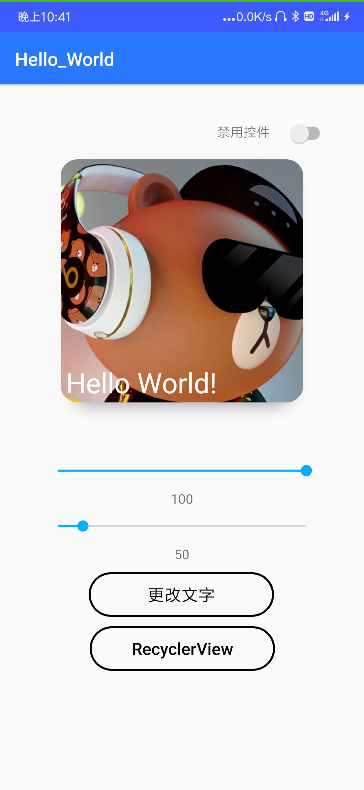
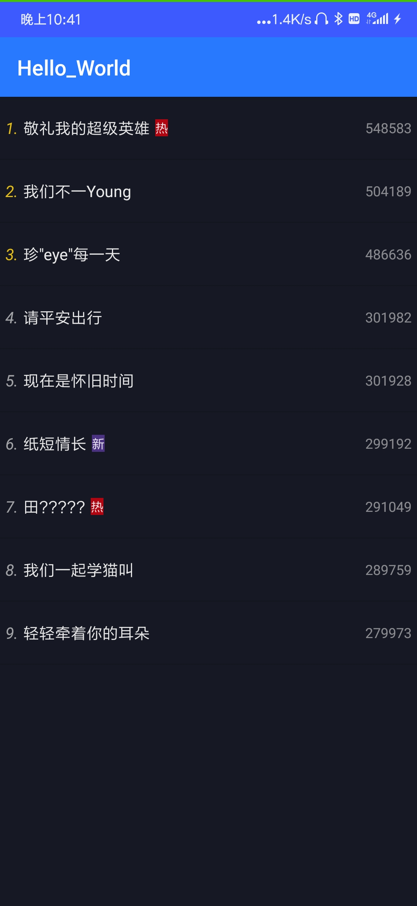
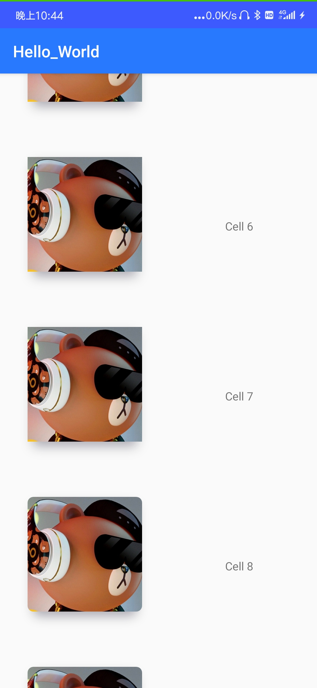

# 目录
[Chapter1作业介绍](#Chapter1-%E4%BD%9C%E4%B8%9A)

[Chapter2作业介绍](#Chapter2-%E4%BD%9C%E4%B8%9A)

# Chapter1 作业

这个程序主要用于学习使用Android自身及部分第三方控件的使用。

## APK
生成的apk在根目录中，为Chapter1.apk。

## Log输出
当按钮被点击和switch状态被改变时Console中会输出相应的信息

## 程序截图

由上至下

Switch用于控制控件是否可使用，打开时所有控件被禁用

中间的图片显示控件为yingLanNull的[ShadowImageView](https://github.com/yingLanNull/ShadowImageView),可以改变圆角边形的半径，同时阴影颜色可根据图片内容而变化

imageView下的第一个SeekBar用于调节image的alpha值

第二个SeekBar用于调节圆角边形的半径

更改文字按钮来自于niniloveyou的[StateButton](https://github.com/niniloveyou/StateButton)，点击后可改变imageView内的文字

# Chapter2 作业
这次的作业基于上一次的工程。

## 介绍

在主页面中点击RecyclerView可跳转至热搜榜模拟页面。

相关文件为RankViewActivity，RankViewAdapter，RankData与RankViewHolder。

在主页面中点击图片可跳转至RecyclerView的测试页面。暂时还存在一点问题😂

